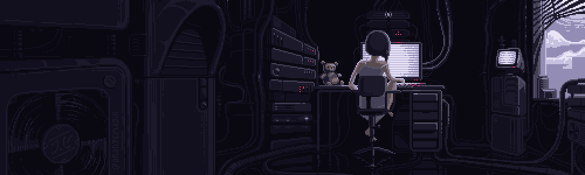

<h2 align="center">⋆˙⟡ hi, i'm soph ⟡˙⋆</h2>

    

    

  

<h2 align="center">☕️ about me</h2>

Computer Science student @ <b>University of Buenos Aires</b> (FCEyN). 
⊹₊˚‧︵‿₊୨ᰔ୧₊‿︵‧˚₊⊹

<h2 align="center">kato !!</h2>

💜 <b><a href="https://katoqr.com.ar">kato</a></b> — a SaaS platform that gives local businesses a real-time digital storefront, 
letting them publish, update and manage their menus & catalogs from a single dashboard. 
🔗 <a href="https://katoqr.com.ar">katoqr.com.ar</a>

<h4 align="center">📊 most used languages (kato)</h4>

<table align="center">
<tr><td>
<pre>
TypeScript   ████████████████████░░   90.5%
JavaScript   █░░░░░░░░░░░░░░░░░░░░░░    4.6%
CSS          █░░░░░░░░░░░░░░░░░░░░░░    2.6%
PLpgSQL      █░░░░░░░░░░░░░░░░░░░░░░    2.3%
</pre>
</td></tr>
</table>

<h2 align="center">⋆ my skills ⋆</h2>

<h4 align="center">💻 languages</h4>

<h4 align="center">📚 frameworks & libraries</h4>

<h4 align="center">🔬 data & scientific</h4>

<h4 align="center">⚙ tools</h4>

<h2 align="center">⊹ reach me ⊹</h2>

